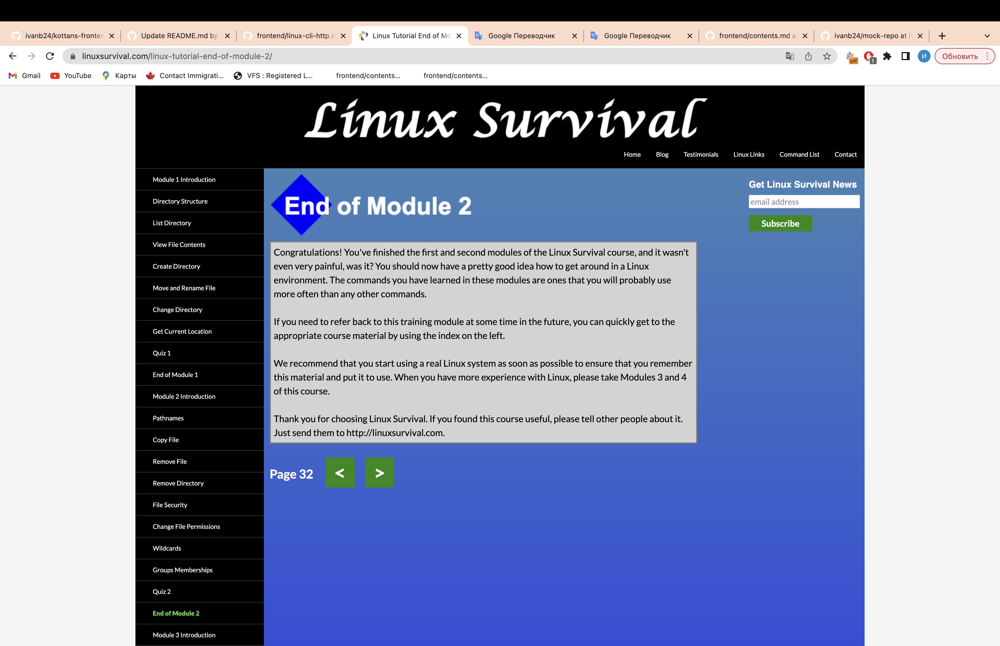
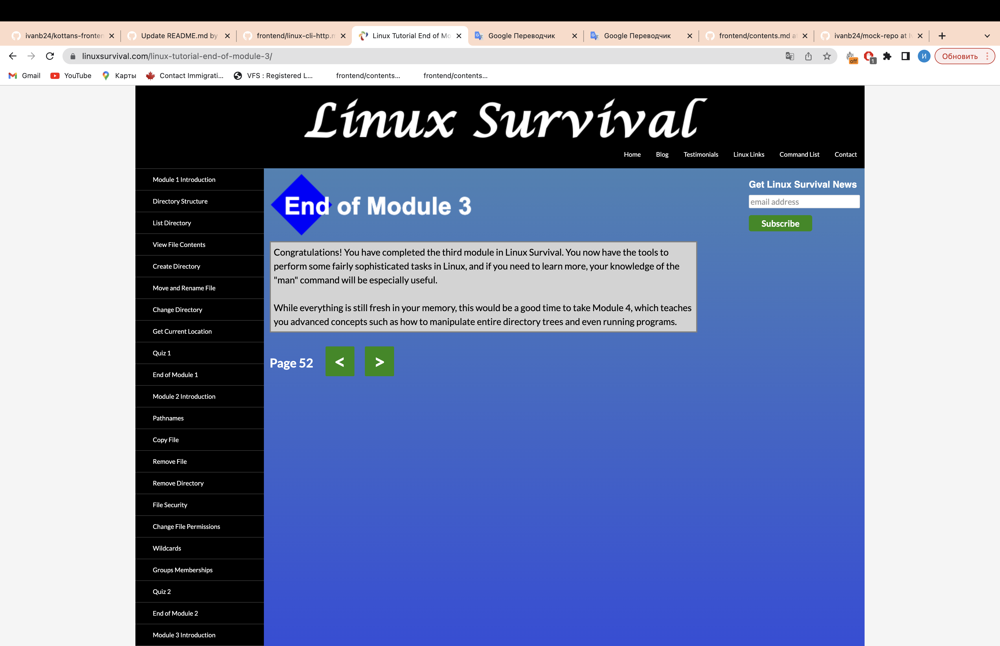
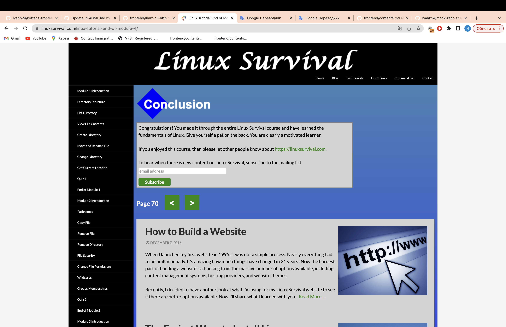

# kottans-frontend
It was very interesting for me to delve into work with GIT. Pleasantly surprised by the number of different commands that can help me to do the tasks better and faster. Now it has become more productivly for me to work in a team using GIT in my projects.
## Linux CLI, and HTTP
I was interested in working with Linux CLI
Many of these commands I used in terminal on Mac and in development environments such as Webstorm and VScode(mkdir, pwd, cd, cd .., etc).
With this knowledge, I am now more confident with the Linux terminal and other relative terminals.
Now I can execute the following and other similar commands not only through the interfaces of programming environments, but also using the terminal, it's a great achievement, thank you!

