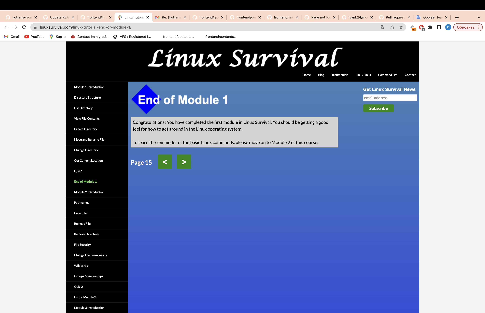

# kottans-frontend
It was very interesting for me to delve into work with GIT. Pleasantly surprised by the number of different commands that can help me to do the tasks better and faster. Now it has become more productivly for me to work in a team using GIT in my projects.
## Linux CLI, and HTTP
I was interested in working with Linux CLI
Many of these commands I used in terminal on Mac and in development environments such as Webstorm and VScode(mkdir, pwd, cd, cd .., etc).
With this knowledge, I am now more confident with the Linux terminal and other relative terminals.
Now I can execute the following and other similar commands not only through the interfaces of programming environments, but also using the terminal, it's a great achievement, thank you!

## Git Collaboration
I`ve repeated arguments for the  git pull, git push, and  git fetch, determined for myself the best ways how to review the code, how make a pull request. Also learned how to tell Git to copy a series of commits to the current location (head) using cherry-pick.

## Intro to HTML and CSS
Passing the task "Intro to HTML/CSS practice" I`ve refreshed my knowledge of the basis of HTML/CSS. I would like to note that Codeacademy tasks are ideally supplement the lectures of Coursera, what will be very useful for those, who are just getting acquainted with HTML/CSS. Thank you!

## Responsive Web Design
In fact, Grid is container-based layout, while Flexbox is content-based. Both are effective in their own way, although I found CSS Grid includes more features and make it easier to manipulate the rows and columns of the grid. For myself I concluded that before deciding which one to use, you should analyze the complexity, structure and content of the site being created. Also want to note that the studying of adaptive web design is more productive if you put the knowledge of theory into practice using games. Thanks, it was fun!

